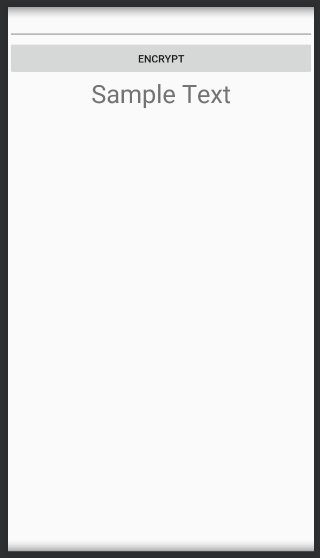

# MCA4044 Assignment 1 - Encrypt App

## Date : 21 January 2019

## Deadline : 24 January 2019, 08:30 a.m

1. You are to create an Android application for this task. Use Android Studio with the prescribed configuration. The specifications for the app are given below

1. The UI for the app will have three views, namely - an editText, a button and a textView.
2. You may choose to name them as per your wish. 
3. All of the views will be created inside a parent layout. You may choose the parent layout of your choice. (We had used LinearLayout(Vertical) in the class).

**The EditText**  - 

The EditText will be a multi-line editText so that the user can enter multiple lines of text in the app.

**The Button** -

The Button will be a simple button to start the encryption process.

**The TextView**

The TextView will be a simple textview to show the result of the encryption to the user.

------

#### The naming convention

The naming convention of resources we follow is -

1. For xml (layout) files - `<viewtype>_<elementname>`
   1. for ex - et_name (et is short for editText and name is the name of the element)
   2. btn_log_in
2. For Java (business logic) files - **Pascal Case**
   1. `Button btnLogin;`
   2. `EditText etText;`

------

## Useful Links

1. https://en.wikipedia.org/wiki/Cryptography
2. https://en.wikipedia.org/wiki/Data_Encryption_Standard
3. https://en.wikipedia.org/wiki/Encryption
4. http://practicalcryptography.com/ciphers/caesar-cipher/

Today's lecture (January 21, 2019) has been uploaded on YouTube - https://youtu.be/emxI5StZRYo

MCA4044 - Mobile Application Development 21 January 2019
Topics discussed

1. Android Layouts - LinearLayout (Vertical)
2. Simple Calculator App
3. Assignment 1
   You can find the MainActivity.java code here - https://gist.github.com/dbc2201/acaa3b90131a2784ed7a462daef64124