# Task 1

As discussed in the class today, you need to configure the following software on your laptop to start building Android apps.

1. Git
2. Android Studio

The following is a To-Do list that you need to complete, in order to complete the configuration.

1. Create a profile on GitHub.

   1. **Important** : Use your official email address provided by GLA for now. For ex - firstname.lastname_branchYEAR@gla.ac.in
   2. Your GitHub username should be professional.
   3. Add a profile picture to your GitHub profile and set your name.

2. Download and install Git on your laptop.

   1. Official website for Git - https://git-scm.com/downloads

   2. After installing Git on your computer, open "command prompt"

      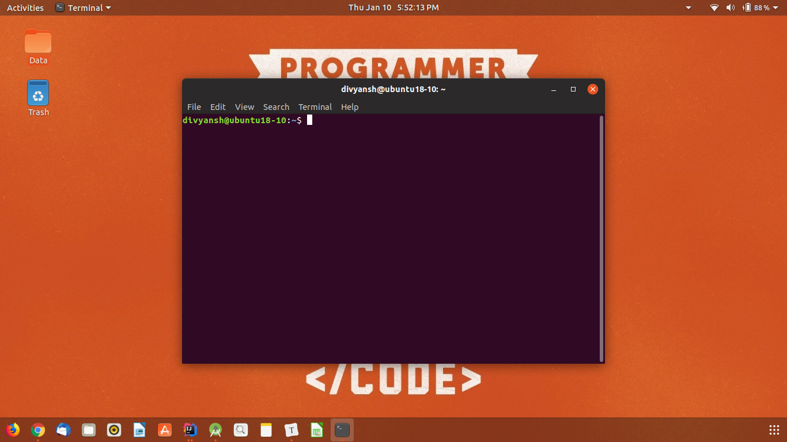

   3. Type the following commands

      1. ```
         git config --global user.name "<Your Username on GitHub>"
         ```

      2. 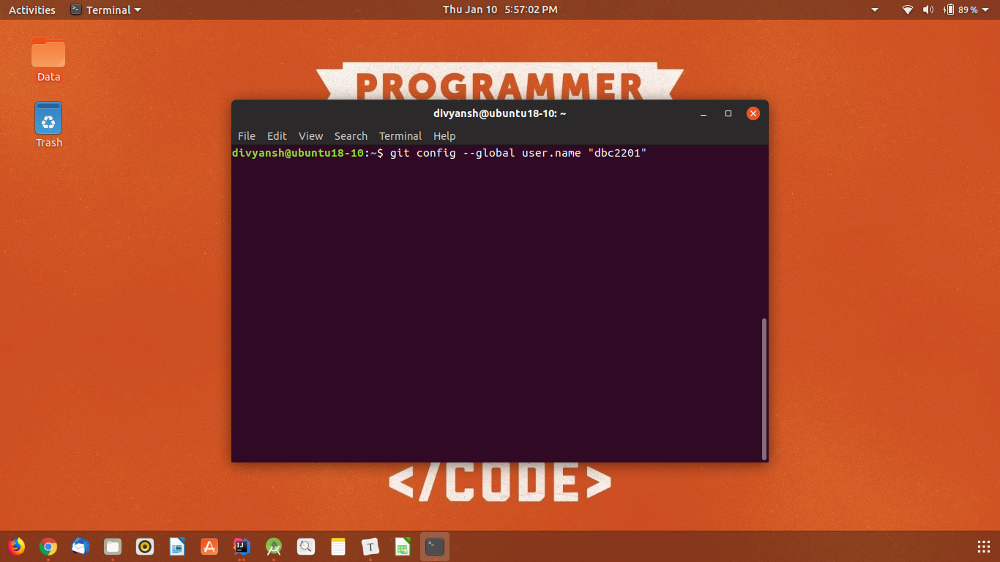

      3. ```
         git config --global user.email "<Your GLA email Address>"
         ```

      4. 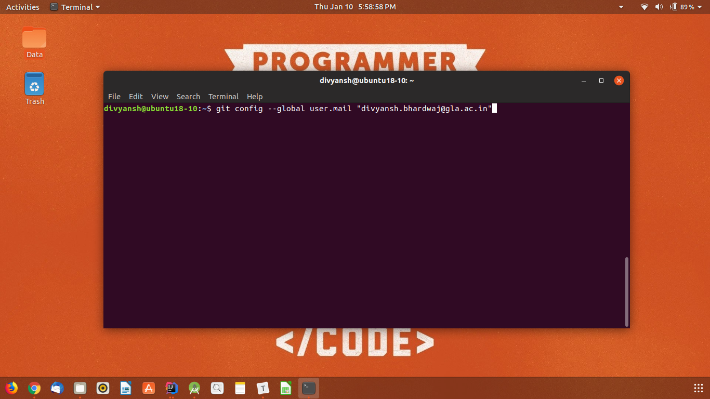

3. Download and install Android Studio on your laptop.

   1. Link to download Android Studio - https://developer.android.com/studio/

   2. Connect to the internet and click on the setup.

   3. Click yes to all prompts and let it finish.

   4. After installing the Android Studio will look like

      

   5. Click on "Configure" option in the bottom right hand side.

      

   6. Click on the latest version of Android and press "Apply" and then "Ok". Android Studio will start downloading the SDK for you.

      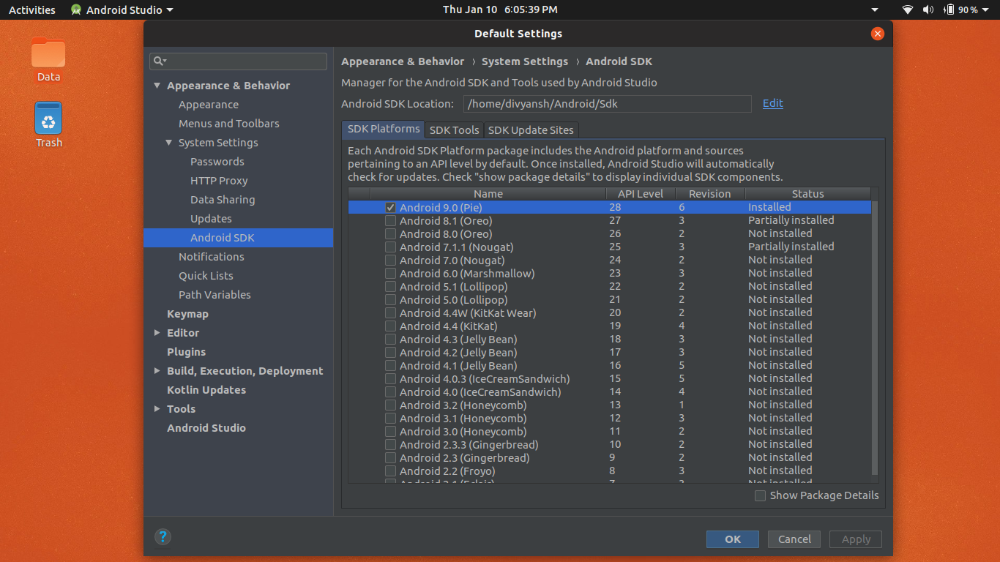

4. Turn on "Developer Options" on your Android mobile phone.

   

5. Create a simple "Hello, World!" app.

   1. 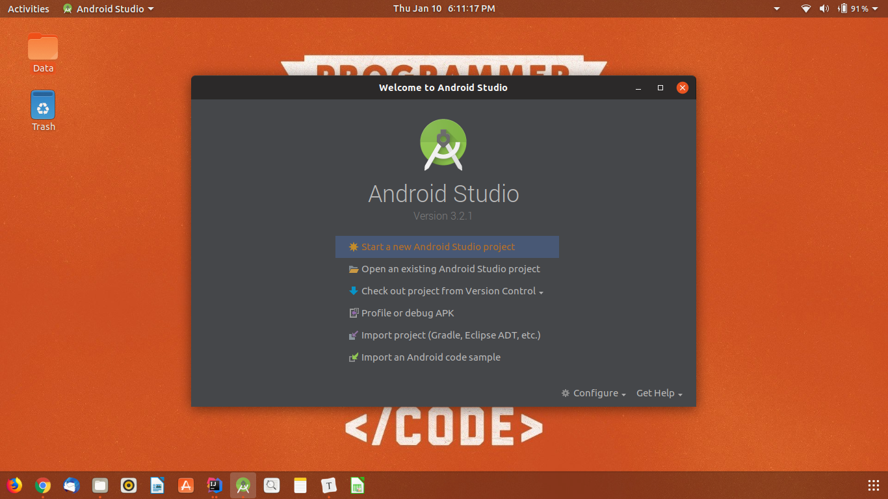
   2. 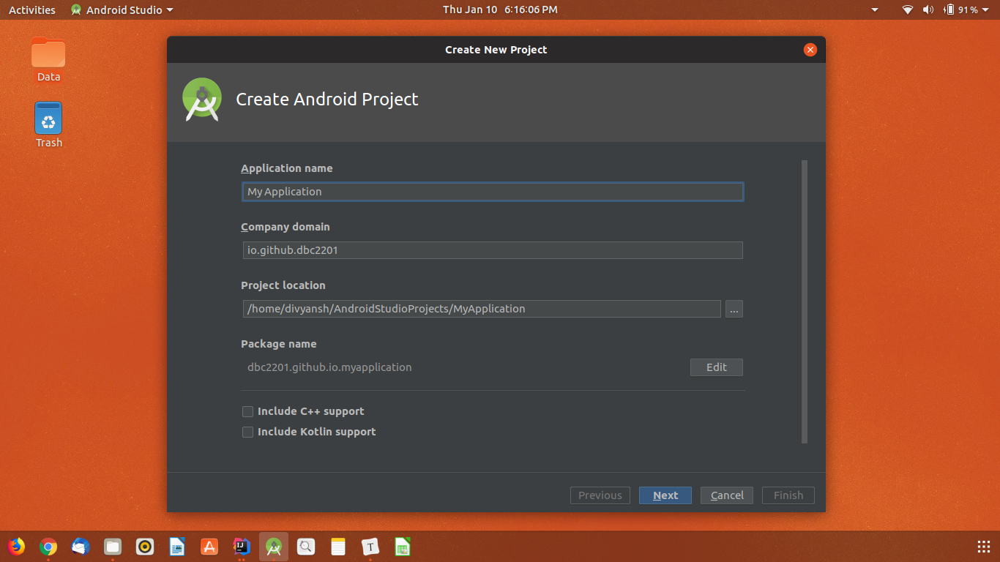
   3. 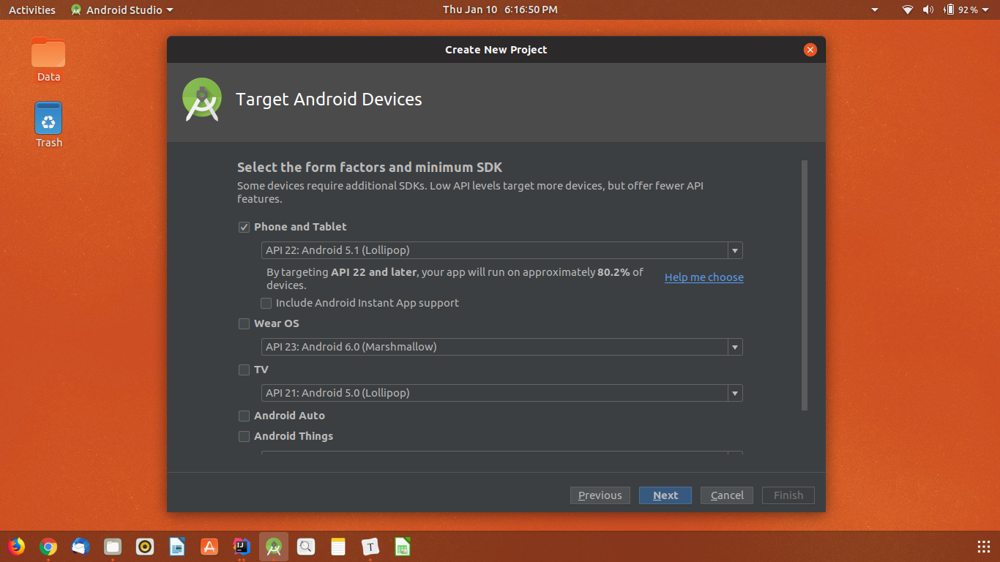
   4. 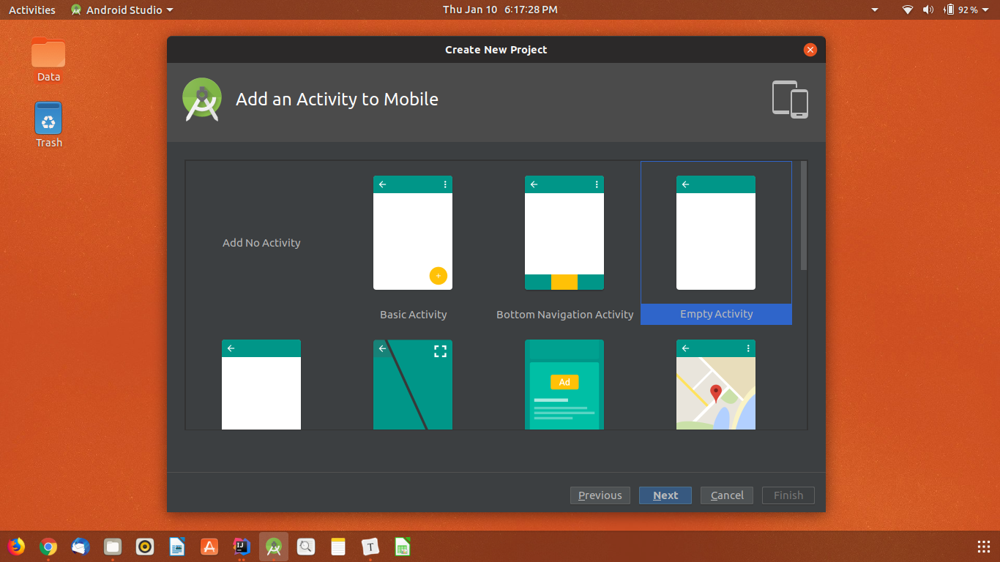
   5. 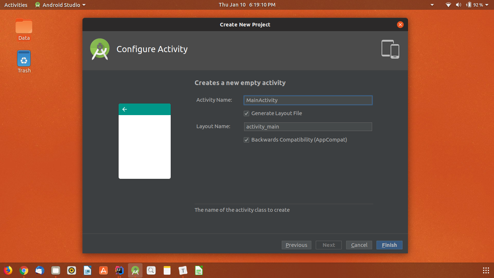
   6. This is how your Android Studio will look like after the project is loaded.
   7. 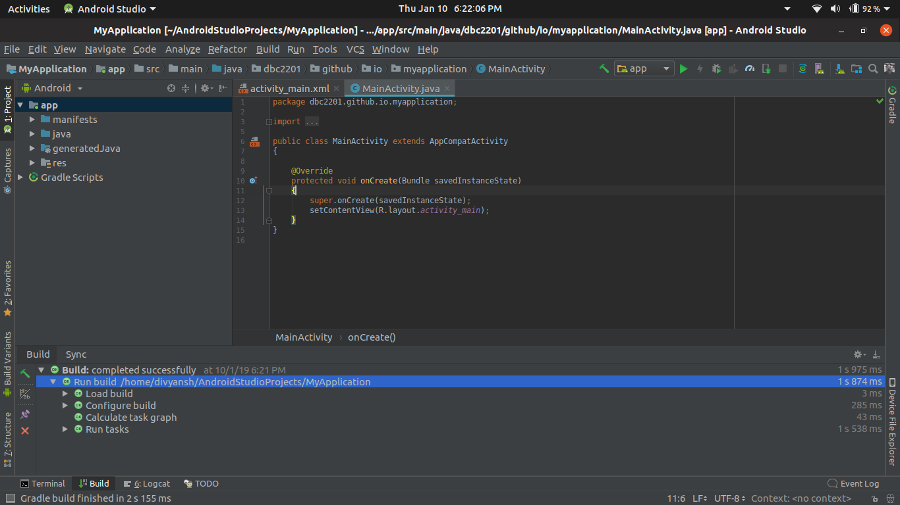

6. Install the app on your phone.

   1. Connect your Android Device via a USB cable and press "Alt+Shift+F10".
   2. 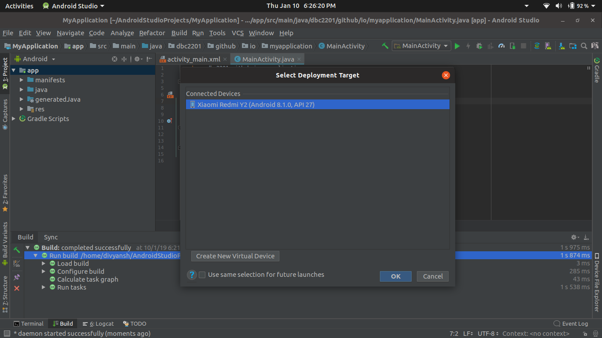
   3. Now press "OK" and the app will be installed on your phone.

7. Upload the project to GitHub.

   1. First initialize Git in your project
      1. Alt + S
      2. Import into version control
      3. Create Git Repository
   2. Now create a commit
      1. Ctrl + K
      2. Click on "unversioned files"
      3. type "init commit" in the message box below
      4. Press Ctrl + Enter
   3. Upload your project on GitHub
      1. Alt + S
      2. Import into version control
      3. Share Project on GitHub
      4. Android Studio will ask you for your GitHub username and password, fill it in.
      5. 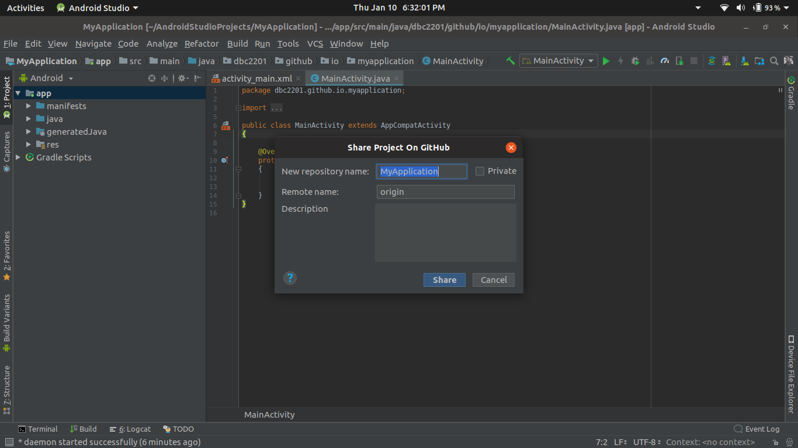
      6. Fill in the values for the Repository name and description, then click ok.

8. Send me the link of your uploaded project.